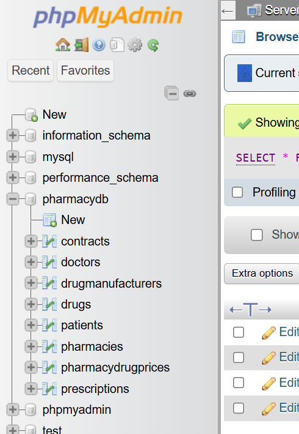
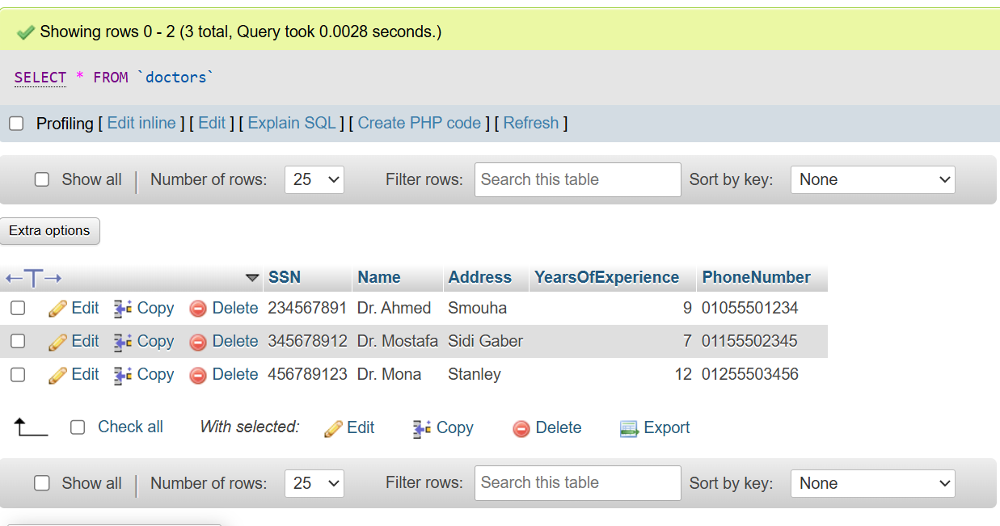
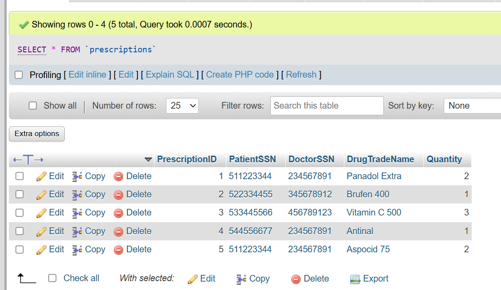

# Pharmacy Management System

A relational MySQL database that models the day-to-day operations of a pharmacy network — doctors, patients, drugs, manufacturers, pharmacies, prescriptions, pricing, and supply contracts.

**Course project · Database (4th semester) · Computer Engineering, AASTMT · September 2024 · Solo project**

## Overview

The goal of this project was to take a real-world scenario (a pharmacy network) and design a complete relational database for it: starting from an entity–relationship model, mapping it to a relational schema, implementing it in SQL, and verifying it with sample data and test queries.

The full design is documented in [Mapping.pdf](Mapping.pdf) — the ER-to-relational mapping diagram showing every table, its primary key, and its foreign key references.

## Database Design

The schema has **8 tables**. Five represent the main entities and three represent the relationships between them:

| Table | Purpose |
|---|---|
| `Doctors` | Physicians, with experience and contact info |
| `Patients` | Patients, each linked to a primary doctor |
| `DrugManufacturers` | Pharmaceutical companies |
| `Drugs` | Drug products, each made by one manufacturer |
| `Pharmacies` | Pharmacy branches |
| `Prescriptions` | Which doctor prescribed which drug to which patient, and the quantity |
| `PharmacyDrugPrices` | Which pharmacy sells which drug, at what price |
| `Contracts` | Supply agreements between pharmacies and manufacturers |

## Key Features

- **Referential integrity enforced by the schema itself** — foreign key constraints make invalid data impossible to insert (e.g., a prescription cannot reference a patient or drug that does not exist).
- **Composite primary key** in `PharmacyDrugPrices` (`PharmacyName` + `DrugTradeName`), so each pharmacy–drug pair has exactly one price.
- **Auto-increment surrogate keys** for prescriptions and contracts.
- **Cascade rule** (`ON DELETE CASCADE`): deleting a manufacturer automatically removes its drugs, keeping the database consistent.
- **Fictional sample dataset** included, plus 8 verification queries — the script runs end-to-end with zero errors.

## Tech Stack

- **MySQL / MariaDB** (via XAMPP)
- **SQL** — DDL (table creation, constraints) and DML (data insertion, queries)
- **phpMyAdmin** for running and verifying the database

## How to Run

1. Install [XAMPP](https://www.apachefriends.org/) and start **Apache** and **MySQL** from the control panel.
2. Open `http://localhost/phpmyadmin` in your browser.
3. Create a new database named `PharmacyDB`.
4. Open the database, go to the **SQL** tab, paste the contents of [`pharmacy.sql`](pharmacy.sql), and click **Go**.
5. You should see the 8 tables created, the sample data inserted, and the results of 8 `SELECT` queries.

Command-line alternative: create the database, then run `mysql -u root -p PharmacyDB < pharmacy.sql`.

## Screenshots

All query outputs are in the [`screenshots/`](screenshots) folder. A few examples:

**The 8 tables created:**

**Doctors table:**

**Prescriptions (linking patients, doctors, and drugs):**

## What I Learned

- Translating an ER model into a relational schema: mapping entities, relationships, composite keys, and foreign keys correctly.
- How database constraints act as a built-in defense for data integrity — the schema rejects inconsistent data instead of trusting every application to behave.
- The trade-off between natural composite keys and auto-increment surrogate keys.
- Setting up and verifying a database end-to-end on a real server (XAMPP, phpMyAdmin).
- Preparing a project for public release: reviewing files and replacing personal-looking sample data with fully fictional data before publishing.

## License

MIT — see [LICENSE](LICENSE).
